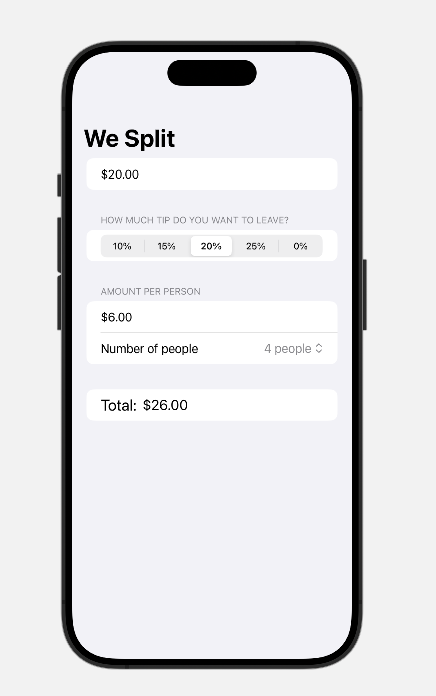

# WeSplit - SwiftUI Tip Calculator

WeSplit is a SwiftUI application that helps you quickly calculate the amount of tip to leave at a restaurant. This project is perfect for learning the fundamentals of SwiftUI and how to create an app involving forms, navigation, user controls, and more. This tutorial is based on the teachings from Hacking with Swift, a fantastic online resource for Swift and iOS development.

## Features

- **Forms and Sections:** Learn how to build forms and organize your user interface into sections for better structure.
- **Navigation:** Explore how to create smooth navigation in your app by creating navigation stacks and navigation bar titles.
- **State Management:** Discover how to use the @State and @FocusState property wrappers to maintain and manage the app's state.
- **User Controls:** Learn to create useful user controls like TextField and Picker to collect user input.
- **Creating Views in a Loop:** See how to dynamically generate views using the ForEach structure.

## Screenshots

## Technologies
- 💻 Swift
- 🖌️ SwiftUI
## Authors

his tutorial is based on the teachings from [Hacking with Swift](https://www.hackingwithswift.com/books/ios-swiftui/wesplit-introduction)
, a fantastic online resource for Swift and iOS development.

## Support

For support, email montserrat.ga95@gmail.com

## License

[MIT](https://choosealicense.com/licenses/mit/)

